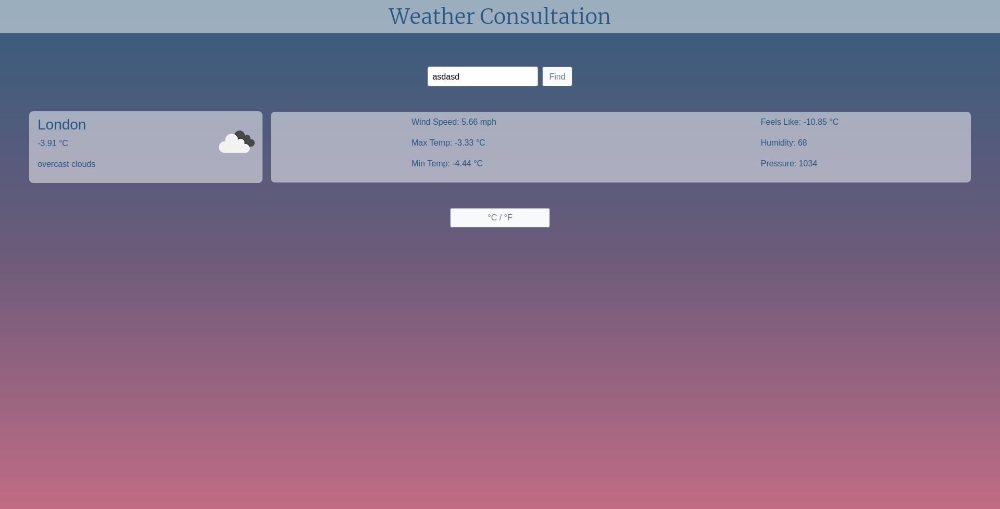

# My Weather App Built Using JS

This app will give you the weather in a specific city that you can type into the search bar.
I built it using Async JS and I'm getting the data using the OpenWeatherMap API.

## Built With

- HTML5 & CSS3
- JavaScript
- Webpack

## Live Demo

[Live Demo Link](https://rawcdn.githack.com/balerum03/weatherAppJS/13dbb0d6827ae3f4432590445c8ffc4cecf856e0/dist/index.html)

## To get a local copy up and running follow these simple example steps.
- Go to the main page of the repo.
- Press the "Code" button and get the repo link.
- Then run `git clone https://github.com/balerum03/weatherAppJS.git` in your console to download the project

## Authors

👤 **Adan Fernandez Bonilla**

- GitHub: [balerum03](https://github.com/balerum03)
- LinkedIn: [Adan Fernandez Bonilla](https://www.linkedin.com/in/adan-fernandez-bonilla/)
- Twitter: [@balerum03](https://twitter.com/balerum03)

## 🤝 Contributing

Contributions, issues, and feature requests are welcome!

Feel free to check the [issues page](issues/).

## Show your support

Give a ⭐️ if you like this project!

## Acknowledgments

- Odin project.
- Stackoverflow.

## 📝 License

This project is [MIT](LICENSE) licensed.
